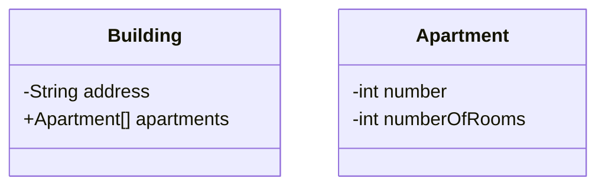

# Building Structure and its Apartments: 

- Design a model to represent an apartment building. A building has an address and is 
composed of several apartments. Each apartment has a number and a number of rooms. 
An apartment cannot exist without the building it belongs to.

- **Expected Functionalities**:
  - Represent a building's characteristics.

  - Represent an apartment's characteristics.

  - Model the relationship where a building contains multiple apartments. Decide whether this relationship is Composition or Aggregation and justify your choice.

  - Allow for the creation of a building by specifying the total number of apartments it will have.

  - Allow for the creation and addition of apartments to a building (likely during or shortly after building construction).

  - Allow for the display of information for all apartments within a building.

  - (Optional) Allow for finding a specific apartment by its number within the building.
