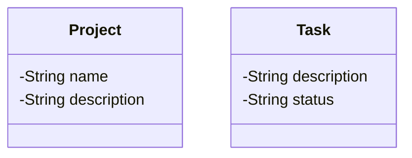

# Building Structure and its Apartments: 

- Design a model to represent an apartment building. A building has an address and is 
composed of several apartments. Each apartment has a number and a number of rooms. 
An apartment cannot exist without the building it belongs to.

- Expected Functionality
    - Represent the characteristics of a project.

    - Represent the characteristics of a task.

    - Model the relationship where a project includes several tasks. Decide whether this relationship is Composition or Aggregation and justify your decision in your code and comments.

    - Allow for the creation of a project with a maximum number of tasks.

    - Allow tasks to be added to a project.

    - Allow for all tasks within a project to be displayed.

    - (Optional) Allow a task to be marked as complete.
